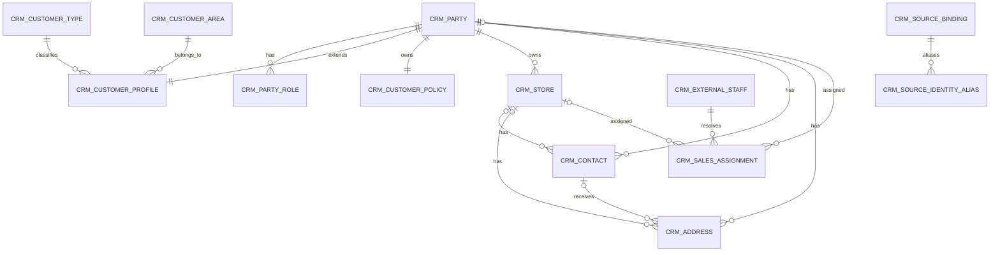

# CRM 接入订货宝一期数据库设计

> 状态：一期后端已按本设计实现；Flyway V1、Integration 查询契约、MyBatis-Plus 落库、CRM 本地查询和同步入口已提交工作区，真实租户联调待执行。
> 核对日期：2026-08-12。
> 适用服务：`rigour-merchant-crm-service`，Schema：`rigour_crm`。
> DDL 草案：[`CRM_DHB_SCHEMA_DRAFT.sql`](./CRM_DHB_SCHEMA_DRAFT.sql)。

## 1. 结论

一期采用“CRM 规范主档 + 外部来源绑定 + 同步运行表”的结构，不把订货宝 ID 当作 CRM 主键，
也不把订货宝完整报文重复建设成 CRM Raw Landing。

- CRM 规范主档负责客户/商家、门店、联系人、地址、销售归属和结算政策。
- `crm_source_binding.source_fields_json` 保存每个查询结果业务对象的完整字段，新增或租户扩展字段不会丢失。
- Integration 继续保存包含响应信封的技术原始回执，并负责 Token、限流、重试和协议转换。
- 来源字段与本地自研字段通过 `ownership_state` 隔离；未来切换自研主写后，订货宝同步仍更新来源快照，但不得覆盖本地业务事实。
- 同步沿用 ERP 的内容指纹、未变更跳过、缺失修复、成功后推进游标和来源缺失核对规则。
- 正式平台标识按统一规范使用 UUIDv7 + `BINARY(16)`。ERP 早期表使用 `CHAR(36)`，本设计只复用其同步模式，不继续复制该历史差异。

本期建议建立 17 张表。`crm_store` 当前没有对应的订货宝查询接口，不把一个订货宝客户强行解释成一间门店；
它作为后续自研门店主档保留。其他 16 张表可参与一期客户同步或同步治理。

## 2. 一个需要纠正的前提

“订货宝有的数据全部落库”必须拆成两层判断：

1. **已调用查询接口实际返回的数据**：可以保证全部落库，结构化列加完整 `source_fields_json` 双保险。
2. **订货宝后台存在但查询接口不返回的数据**：当前无法保证同步，不能靠数据库设计补齐。

官方文档已经暴露以下覆盖缺口：

- [`getDealersList`](https://docs.dhb168.com/books/erp/page/getdealerslist) 不返回
  [`addDealers`](https://docs.dhb168.com/books/erp/page/adddealers) / [`updateDealers`](https://docs.dhb168.com/books/erp/page/updatedealers)
  入参中的 `amount`（账户余额）和 `credit`（应收余额）。
- `clientPassword` 只存在于新增接口入参，不是查询数据，也不应在 CRM 保存密码列。
- [`getStaffInfo`](https://docs.dhb168.com/books/erp/page/getstaffinfo) 需要 `accounts_id`，
  但 [`getStaffList`](https://docs.dhb168.com/books/erp/page/getstafflist) 的已声明列表字段没有 `accounts_id`；
  只有真实租户列表回执包含该字段时才能稳定批量补拉详情。
- 员工详情示例出现未列入字段表的 `group_id_str`，说明真实回执可能超出文档字段；必须保留完整字段 JSON。
- 订货宝客户章节的余额同步、预存款充值/扣款属于写操作；客户返利、收付款属于交易/财务来源事实，
  不应因为目录靠近客户档案就写入 CRM。

因此一期验收口径应写成：**本期范围内所有读取接口实际返回的业务字段 100% 可追溯落库；接口未返回字段进入覆盖缺口清单。**

## 3. 领域边界

固定调用链：

```text
Portal
  -> Gateway
  -> Merchant CRM
  -> integration-migration-api
  -> Integration
  -> 订货宝
```

职责不能倒置：

| 层 | 职责 |
|---|---|
| Portal | 查询 CRM 本地列表/详情；触发 CRM 的立即同步入口；不实时访问订货宝 |
| Merchant CRM | 同步编排、领域校验、幂等落库、客户/门店/归属/政策主权、查询 API；一期预留 Outbox 表但不发布领域事件 |
| Integration | 订货宝认证、Token、协议、分页、限流、重试、Raw Landing、字段归一化 |
| Sales Work | 消费 CRM 客户/门店/归属事件，维护最小只读投影；不反写 CRM 主档 |
| HR | 内部员工与任职主权；CRM 的外部员工表只用于解析订货宝 `staffID` |
| Order/未来 Finance | 订单、应收、回款、余额、返利流水；CRM 只维护信用与结算政策 |

CRM 不保存订货宝账号、密码、`sKey`、Token、Secret 或完整响应信封。Integration Raw Landing 是技术原始回执的唯一存储。

## 4. 一期读取接口范围

| 对象 | 订货宝接口 | 同步方式 | CRM 结果 |
|---|---|---|---|
| 客户类型/等级 | [`getClientTypeList`](https://docs.dhb168.com/books/erp/page/getclienttypelist) | 每次全量，小表 | `crm_customer_type` + 来源绑定 |
| 客户经营归属地区 | [`getArea`](https://docs.dhb168.com/books/erp/page/getarea) | 每次全量，小表 | `crm_customer_area` + 来源绑定 |
| 员工目录 | [`getStaffList`](https://docs.dhb168.com/books/erp/page/getstafflist) | 首次全量，之后按更新时间重叠增量 | `crm_external_staff` + 来源绑定 |
| 员工详情 | [`getStaffInfo`](https://docs.dhb168.com/books/erp/page/getstaffinfo) | 有可靠 `accounts_id` 时补拉 | 合并到 `crm_external_staff`，完整字段进来源 JSON |
| 客户档案 | [`getDealersList`](https://docs.dhb168.com/books/erp/page/getdealerslist) | 首次全量，之后按 `update_date` 重叠增量 | Party/客户/联系人/政策/归属 + 来源绑定 |
| 客户收货地址 | [`getShippingAddressList`](https://docs.dhb168.com/books/erp/page/getshippingaddresslist) | 首次全量，之后按时间重叠增量 | `crm_address`、必要联系人 + 来源绑定 |

全量客户查询必须使用 `status=3`、`data_type=3`，否则官方默认只返回启用、未同步客户，会造成确定性缺数。
收货地址全量查询不得带 `isDefault`，否则只能获得默认或非默认地址子集。员工全量查询不带 `staff_type` 和 `status` 过滤。

一期不接入：`addDealers`、`updateDealers`、`syncClientBalance`、`depositRecharge`、地址新增/修改、客户类型/地区写接口、返利和收付款写操作。

## 5. 数据模型



### 5.1 规范 CRM 主档

| 表 | 作用 | 一期订货宝数据 |
|---|---|---|
| `crm_party` | 客户/商家统一经营主体 | 名称、内部编号、规范状态 |
| `crm_party_role` | 同一主体的 CUSTOMER/MERCHANT 角色 | 为导入客户建立 CUSTOMER 角色 |
| `crm_customer_profile` | 客户类型、地区、账号、备注、邀请人等客户资料 | `getDealersList` |
| `crm_customer_type` | 客户类型/等级字典 | `getClientTypeList` |
| `crm_customer_area` | 客户经营归属地区，不是收货地址的省市区 | `getArea` |
| `crm_customer_policy` | 当前结算模式和未来自研信用政策 | 一期只映射 `clientClearingForm` |
| `crm_store` | 客户/商家下的实体门店主档 | 当前无官方门店读取接口，不自动造数据 |
| `crm_contact` | 客户/门店联系人 | 客户主联系人、收货联系人 |
| `crm_address` | 联系、收货、开票、注册地址 | `clientAdd` 和收货地址列表 |
| `crm_external_staff` | 订货宝员工引用投影，不冒充 HR 员工 | 员工列表/详情 |
| `crm_sales_assignment` | 客户或门店销售归属有效期历史 | `staffID/staffName` |

### 5.2 来源与同步治理

| 表 | 作用 |
|---|---|
| `crm_source_binding` | 外部身份、来源摘要、完整业务字段 JSON、内容哈希、出现状态和本地目标绑定 |
| `crm_source_identity_alias` | 同一对象的 GUID、编号、账号和 ERP ID 多身份解析 |
| `crm_sync_run` | 每个对象类型的批次、窗口、统计和错误摘要 |
| `crm_sync_checkpoint` | 仅在完整成功落库后推进的增量游标 |
| `crm_sync_lock` | 租户 + 连接器 + 对象类型租约锁，阻止重复并发任务 |
| `crm_outbox_event` | 二期启用客户、门店、地址、归属和政策变化事件时使用；一期只预留结构 |

## 6. 字段完整落库映射

以下映射只列结构化目标。每一行原始业务对象还必须整体进入
`crm_source_binding.source_fields_json`，保留字段名大小写、空值、未知字段和租户扩展字段。

### 6.1 `getClientTypeList`

| 订货宝字段 | 结构化目标 |
|---|---|
| `typeName` | `crm_customer_type.type_name` |
| `typeID` | 来源绑定 `source_object_id`；类型别名 `ID` |
| `erpID` | 来源别名 `ERP_ID`；不得当 CRM 主键 |

### 6.2 `getArea`

| 订货宝字段 | 结构化目标 |
|---|---|
| `AreaName` | `crm_customer_area.area_name` |
| `AreaID` | 来源绑定 `source_object_id`；地区别名 `ID` |
| `ERPID` | 来源别名 `ERP_ID` |
| `parentID`（若供应商响应提供） | `crm_customer_area.parent_area_code`；查询接口同时解析为父地区 UUID |

`area` 批量新增接口通过 `parentID` 定义父子关系；当前 `getArea` 文档示例未返回该字段，
因此同步只在实际响应提供 `parentID` 时落库，缺失时保持为空，不按地区名称猜测地区树。
`clientArea` 是客户经营归属，不能与收货地址的省市区文本混为一张表。

### 6.3 `getDealersList`

| 订货宝字段 | 结构化目标 |
|---|---|
| `clientGUID` | 客户来源主身份和 `GUID` 别名 |
| `clientAccount` | `crm_customer_profile.login_account` |
| `clientCompanyName` | `crm_party.display_name` |
| `clientNO` | 来源 `source_code`、`NUM` 别名；首次导入可生成内部 `party_code` |
| `clientType` | 关联 `crm_customer_type` 的来源 ID |
| `clientArea` | 关联 `crm_customer_area` 的来源 ID |
| `clientAreaGUID` | 地区来源别名；文档示例可能不返回，保持可空 |
| `clientAbout` | `crm_customer_profile.remark` |
| `clientTrueName` | 主 `crm_contact.contact_name` |
| `clientEmail` | 主 `crm_contact.email` |
| `clientPhone` | 主 `crm_contact.phone` |
| `clientAdd` | `crm_address` 的 CONTACT 地址 |
| `staffName` | `crm_sales_assignment.source_name_snapshot`；默认建立 `PRIMARY` 归属 |
| `clientTypeName` | `customer_type_name_snapshot`，同时用于字典缺失修复 |
| `clientAreaName` | `customer_area_name_snapshot`，同时用于字典缺失修复 |
| `Inviter` | `crm_customer_profile.inviter_name` |
| `staffID` | `crm_sales_assignment.source_staff_id`，并在员工目录可解析时关联 `crm_external_staff.source_staff_id`；建立 `PRIMARY` 归属 |
| `createDate` | 来源绑定 `source_created_at` |
| `updateDate` | 来源绑定 `source_updated_at`、增量水位候选 |
| `clientStatus` | 来源 `source_status`，再映射规范状态；保留原值 T/F/A/C |
| `clientClearingForm` | `crm_customer_policy.settlement_mode`；保留 prepaid/forward/postpaid 原值 |
| `clientCity` | `crm_customer_profile.city_text`，不从字符串猜 `city_id` |

`clientGUID` 的文档语义会因“是否已同步 ERP”而变化，不能假定它是永远不变的订货宝数据库主键。
导入时同时登记 `clientGUID`、`clientNO`、`clientAccount` 别名；找不到主身份时用唯一别名回查已有绑定，避免重复建客户。

订货宝租户可能在客户回执中扩展返回多值业务员或业务员列表。同步时按来源顺序建立一个 `PRIMARY` 和多个
`SECONDARY` 归属；如果员工目录尚未同步，仍先保存 `source_staff_id/source_name_snapshot`，待员工投影可解析后补齐
`external_staff_id`。无法确认语义的扩展字段继续完整保存在来源快照中，不因规范化失败丢弃客户记录。

### 6.4 `getShippingAddressList`

| 订货宝字段 | 结构化目标 |
|---|---|
| `addressId` | 地址来源 `ID` 别名 |
| `clientId` | 所属客户来源 `ID` 别名 |
| `clientNum` | 所属客户 `NUM` 别名 |
| `consignee` | `crm_address.consignee` |
| `contact` | 收货 `crm_contact.contact_name` |
| `phone` | 收货 `crm_contact.phone` |
| `address` | `crm_address.region_text` |
| `isDefault` | `crm_address.is_default`；保留 T/F 原值 |
| `updateDate` | 地址来源绑定 `source_updated_at` |
| `addressDetail` | `crm_address.address_detail` |
| `addressGuid` | 地址来源主身份或 `GUID` 别名 |
| `clientGuid` | 所属客户 `GUID` 别名 |
| `areaName` | `crm_address.area_name` |

地址身份优先使用非空 `addressGuid`，否则使用 `addressId`；两者都登记为别名。所属客户通过
`clientGuid -> clientNum -> clientId` 顺序解析。暂时无法唯一解析时仍写入 `crm_source_binding` 的完整字段快照，
将 `binding_status` 标为 `UNRESOLVED` 且不创建规范地址；字典或客户补齐后通过 REPAIR 批次解析，避免数据只停留在 Integration Raw。

### 6.5 `getStaffList/getStaffInfo`

| 订货宝字段 | 结构化目标 |
|---|---|
| `staff_id` | `crm_external_staff.source_staff_id` |
| `accounts_id` | `source_account_id`；列表缺失时保持 NULL |
| `staff_type` | `staff_type` |
| `accounts_name` | `account_name` |
| `staff_name` | `staff_name` |
| `title` | `title` |
| `branch_name` | `branch_name` |
| `accounts_mobile` | `account_mobile` |
| `about` | `remark` |
| `role` | `role_name` |
| `invite_code` | `invite_code` |
| `mobile` | `mobile` |
| `email` | `email` |
| `qq` | `qq` |
| `create_date` | `source_created_at` |
| `update_date` | `source_updated_at` |
| 未声明字段，如示例中的 `group_id_str` | 完整 `source_fields_json` |

`crm_external_staff` 只是解释订货宝客户 `staffID` 的来源投影。真正的内部员工、任职、离职和部门主权仍在 HR；
完成匹配后只填写跨服务 `sales_profile_id`，不建立跨 Schema 外键。

## 7. 同步与变更规则

### 7.1 首次全量顺序

```text
客户类型 -> 经营归属地区 -> 员工目录 -> 客户 -> 收货地址
```

引用字典先落库，客户归属和地址才能稳定解析。每个对象类型使用独立 `crm_sync_run`、游标和锁，
一个对象失败不允许伪装整批成功。

### 7.2 后续增量演进规则

当前一期实现采用完整全量读取和内容哈希幂等落库，优先保证字段覆盖和结果可核对；以下为完成真实租户分页、时间语义和删除行为验证后再启用的增量规则：

- 客户按 `time_type=update_date` 查询，以上次成功落库时间向前重叠 5 分钟。
- 员工按 `update_date_start/end` 查询，同样使用重叠窗口。
- 收货地址按接口的 `startTime/endTime` 查询；真实租户联调前暂不宣称该时间一定等于更新时间。
- 客户类型和经营归属地区没有更新时间字段，继续小表全量并使用内容哈希跳过。
- 游标只在当前对象所有分页完成、事务落库成功后推进；失败分页不得推进。
- `rTotal` 在文档示例中既可能是数字也可能是字符串，Integration 契约统一转为 `long`。

### 7.3 未变更、变化和缺失修复

1. 对单条 `source_fields_json` 做稳定键排序和标准化后计算 SHA-256。
2. 哈希未变、规范实体完整、关联完整：计为 `duplicate`，不执行业务表 UPDATE，不递增业务版本。
3. 哈希未变但规范字段、联系人、地址、字典关系或归属缺失：只补缺失数据，计为 `repaired`。
4. 哈希变化：更新来源绑定；按 `ownership_state` 决定是否更新规范主档，确有业务变化才递增聚合版本；二期启用事件后再写 Outbox。
5. 新增未知字段会改变哈希并写入完整 JSON，即使当前 Java DTO 尚未结构化该字段也不会丢失。
6. 当前响应与上次来源快照按字段合并；明确返回 `null` 会覆盖旧值，字段完全缺失则保留旧快照和规范值，防止租户接口版本差异造成数据擦除。

### 7.4 状态、删除和来源缺失

- `clientStatus=F` 是来源停用，不等于逻辑删除；保留客户、地址、归属和历史引用。
- 查询接口没有删除时间或 tombstone。只有完整成功的全量批次才能做“不再出现”核对。
- 第一次全量未见标为 `ABSENT_CANDIDATE`；连续两次成功全量未见才标为 `ABSENT`，不物理删除。
- 任一失败、超页上限、`rTotal`/返回数量异常的全量批次都不得执行缺失标记。
- 来源重新出现时恢复 `PRESENT` 并清零缺失确认次数。

### 7.5 销售归属变化

订货宝主业务员 `staffID` 变化时不能覆盖历史行：结束旧的 ACTIVE PRIMARY 归属，插入新归属并记录生效时间。
辅业务员按 `SECONDARY` 关系独立保存；来源新增、变更或移除时只调整对应的订货宝导入关系，不覆盖人工或规则归属。
同一客户或门店同时只允许一个 ACTIVE PRIMARY；数据库使用条件生成列和唯一键兜底。

### 7.6 自研主写切换

| `ownership_state` | 来源同步规则 |
|---|---|
| `EXTERNAL_PRIMARY` | 订货宝是主写，可更新允许映射的规范字段 |
| `SHADOW_VALIDATING` | 更新来源快照并核对；规范字段按明确映射更新 |
| `INTERNAL_PRIMARY_SYNC_BACK` | 只更新来源快照和差异，不覆盖本地规范字段 |
| `INTERNAL_ONLY` | 不再调用订货宝，只保留历史来源绑定 |

手机号、邮箱等当前按用户决定不脱敏存储和展示，但仍不得写入普通日志、错误消息或 Outbox 非必要字段。
密码、Token、Secret 无论是否要求脱敏都不进入 CRM。

## 8. 性能与稳定性

- 官方上限是每批 1000；一期默认 `page_size=500`，允许配置到 1000，避免单页 JSON、事务和 GC 峰值过大。
- 每个租户/连接器/对象类型只允许一个运行任务；不同对象可受 Integration 全局限流约束并行。
- 客户列表索引覆盖状态、名称、类型、经营地区和更新时间；地址覆盖客户 + 类型 + 默认标记；归属覆盖客户/门店 + 当前状态。
- Portal 列表只查询 CRM 本地规范表，不解析大 JSON、不调用 Integration；扩展字段只在详情页按需读取。
- 列表 DTO 不返回完整 `source_fields_json`；详情将“规范字段”和“来源扩展字段”分区展示，避免所有内容堆在一起。
- 全量同步先完整读取受 `maxPages` 保护的分页结果，再按单条来源对象短事务提交；不用一张覆盖全量的长事务，批次成功状态在全部对象落库后更新。
- 来源绑定唯一键包含 `tenant_id + connector_id + source_system + object_type + source_object_id`，支持同租户多订货宝账套。

## 9. 暂不建模为 CRM 事实的数据

| 数据 | 原因和去向 |
|---|---|
| `clientPassword` | 密码输入项，不是查询数据；禁止落 CRM |
| `amount` 账户余额 | 当前读取接口不返回；属于预存/资金事实，后续归 Order/Finance |
| `credit` 应收余额 | 当前读取接口不返回；不是“信用额度”，后续归 Order/Finance |
| 返利流水 | 交易/财务来源事实，后续归 Order/Finance，不写 CRM 主档 |
| 订单和应收摘要 | CRM 页面只读跳转，事实主权在 Order |
| HR 员工正式档案 | `crm_external_staff` 仅为订货宝引用；正式员工主权在 HR |
| 订货宝后台未通过 API 返回的自定义字段 | 列为能力缺口；不能从页面猜测或伪造 |

## 10. 上线前剩余验收条件

1. 用真实租户只读调用六类接口，留存字段键集合、空值形态、最大长度和分页行为，不记录 Secret。
2. 确认 `clientGUID` 在已同步/未同步客户间的真实稳定性，以及 `clientArea` 与 `clientAreaGUID` 的关系。
3. 确认员工列表真实回执是否带 `accounts_id` 和 `status`，决定是否批量调用详情。
4. 确认收货地址时间筛选语义和删除/停用行为。
5. 确认订货宝账号级 QPS、每日配额及多实例共享限流方案。
6. 草案文件本身不得当迁移执行；运行时只执行 CRM 服务内的 Flyway V1。
7. 保持 `DhbCustomerApi` 和 `DhbEmployeeApi` 独立版本化契约，不得复用商品/订单总接口，也不得让 CRM 直接持有订货宝客户端。
8. 在可用 Docker 环境中运行 MySQL 8.4 Testcontainers，验证全部 DDL、租户隔离、幂等、乱序、缺失修复、连续两次缺失确认和归属历史。

## 11. 评审建议

建议批准本模型作为一期实现基线，但把“全部数据”验收口径限定为查询接口实际返回字段。
若业务必须同时获得账户余额、应收余额、发票资料或后台自定义字段，应先向订货宝确认对应的只读接口或新增接口，
再决定其领域归属；不能通过调用有副作用的写接口或抓取管理端页面补数据。
